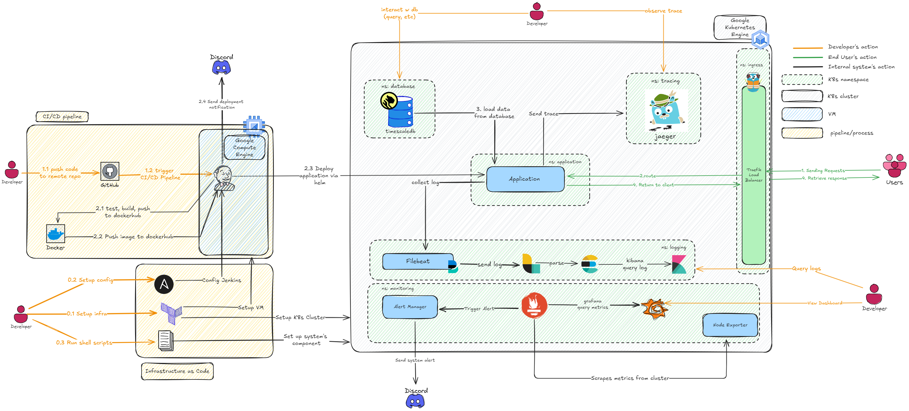
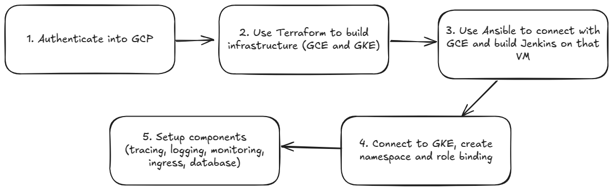

# Table of Contents


* [Introduction](#introduction)
    * [Project Goal](#project-goal)
    * [Data Source](#data-source)
* [Repository Structure](#repository-structure)
* [High-level System Architecture](#high-level-system-architecture)
* [Guide to Install and Run Code](#guide-to-install-and-run-code)
    * [Briefly Introduce about the CI/CD Process](#briefly-introduce-about-the-cicd-process)
    * [Requirements](#requirements)
    * [Setup the Environment Variables](#setup-the-environment-variables)
        * [GitHub Credential](#github-credential)
        * [Docker Hub Credential](#docker-hub-credential)
        * [Discord Webhook URL](#discord-webhook-url)
    * [Setup the Infrastructure](#setup-the-infrastructure)
    * [Setup Your Project on Jenkins](#setup-your-project-on-jenkins)
        * [Login and Use Initial Credentials](#login-and-use-initial-credentials)
        * [Install All Required Plugins and Setup K8s Cloud](#install-all-required-plugins-and-setup-k8s-cloud)
        * [Setup Project and Credentials](#setup-project-and-credentials)
        * [Observe the Deployment Process](#observe-the-deployment-process)
    * [Navigate to the system's components](#navigate-to-the-system's-component)
        * [Logging Component (Using ELK Stacks)](#logging-components)
        * [Monitoring Component (Using Prometheus and Grafana)](#monitoring-components)
        * [Database Component (Using TimeScaleDB - an extension of Postgres)](#database-components)
        * [Tracing Component (Using Jaeger and OTEL)](#tracing-components)
* [Further Development](#further-development)


# Introduction

Demand Forecasting task in supply chain is a very important (+ critical). **A good forecasting system not only help you to increase service level, but also help you with decrease your inventory holding cost** - This is based on the supply chain triangle


For simplicity, we only use a simple dataset. 


## Project Goal 

This project aims to **build a forecasting model to predict bike-sharing demand at a station over the next 36 hours**. The goal is to help operators better manage bike distribution by providing daily demand forecasts at 12:00 for the rest of the day and the following day. While the current focus is on a single station, the approach can be scaled to multiple stations using multi-series forecasting.

In addition to solving a real-world demand forecasting problem, **this project also serves as a hands-on opportunity to practice MLOps** - a very valuable skill I learn from [Full Stack Data Science](https://fullstackdatascience.com/) (they provide English courses as well). This includes automating the training pipeline, deploying the model as a service, setting up monitoring, and ensure HA to ensure the model remains reliable and maintainable in production.


## Data Source

The data presented here capture the hourly usage of Washington, D.C.’s Capital Bikeshare system during 2011–2012, including trip counts, weather conditions, and holiday indicators. Originally sourced from the UCI Machine Learning Repository, each timestamped observation records the number of bike rentals per hour alongside contextual variables such as temperature, humidity, wind speed, weather category, and whether the day was a holiday or working day

Before analysis, the dataset underwent several preprocessing steps:

  - Columns were renamed for clarity.

  - Weather categories were consolidated (e.g., merging heavy rain with rain).

  - Normalized climate features—temperature, humidity, and wind speed—were converted into denormalized, interpretable measurements.

  - A unified date_time field was created and set as the index for chronological access.

  - Any missing entries were forward‑filled to maintain continuity.

| **Variable**   | **Type**           | **Description**                                                                 |
|----------------|--------------------|---------------------------------------------------------------------------------|
| `date_time`    | datetime (index)   | Timestamp at hourly granularity (YYYY-MM-DD HH:MM:SS), sorted chronologically. |
| `users`        | numeric            | Number of bike rentals during the hour |
| `holiday`      | binary (0/1)       | 1 if the date is a holiday per DC calendar, 0  |
| `weather`      | categorical        | Simplified weather category (e.g. “clear”, “mist”, “rain”).|
| `temp`         | numeric (°C)       | Denormalized actual temperature|
| `atemp`        | numeric (°C)       | Denormalized "feels-like" (apparent) temperature in Celsius. |
| `hum`          | numeric (%)        | Denormalized relative humidity percentage. |
| `windspeed`    | numeric (km/h)     | Denormalized wind speed in km/h. |


# Repository Structure
```
.
├── assets/                                 # This folder contain all image, gif that is being used by the README.md
├── Dockerfile                              # This is the Dockerfile of the main application (aka the src/)
├── example.env                             
├── helm-charts
│   ├── application/                        # Main application helm chart
│   ├── elk/                                
│   │   ├── elasticsearch/                  # elasticsearch helm chart
│   │   ├── filebeat/                       # filebeat helm chart
│   │   ├── kibana/                         # kibana helm chart
│   │   └── logstash/                       # logstash helm chart
│   ├── jaeger                              # jaeger helm chart
│   ├── kube-prometheus-stack/              # prometheus and grafana helm chart
│   ├── timescaledb-single/                 # traefik helm chart
│   └── traefik/
├── infrastructure
│   ├── jenkins/                            # Ansible folder to build jenkins container
│   └── terraform/                          # Terraform folder to build infrastructure i.e VM, K8s cluster
├── jenkins /
│   └── scripts/                            # Scripts that will be import into Jenkins pipeline
├── Jenkinsfile                                 
├── notebooks/                               # To test model and model configuration
│   └── main.ipynb
├── README.md
├── requirements.txt
├── setup_infra.sh                          # Setup scripts to setup all the components
├── src/                                    # Application source code
│   ├── api/                                # API of applicaion
│   ├── data/                               # Data preparation
│   ├── model/                              # Model's logic
│   └── static/                             # Simple front end
└── test/                                   # Code to test application before release
    ├── conftest.py                         
    ├── data/
    ├── fixtures/
    ├── model/
    ├── test_api/
    └── test_data.csv

```

# High-level system architecture

Looking at a high-level view, this is what the system look like:



# Guide to install and run code
## Briefly introduce about the CI/CD Process
Basically, what we are trying to do the following steps are following this pipeline:


## Requirements
Since the application is being made on cloud, make sure to have google cloud and that you have enough credits. Additionally, we need things like:
- Google cloud cli (mainly for interacting with GCP services)
- Kubernetes (for deploying application)
- Terraform (for building services (i.e Google Compute Engine or Google Kubernetes Engine))
- K9s (a very powerful tool for visualize cluster operations)
- Ansible (for configuring apps on servers - often used with Terraform)
- DBeaver (free and multi-platform database tool and SQL client, nice UI as well)
## Setup the environment variable
We need to use these credential later on in the project, therefore I recommend to store it in the ```.env``` file and use it later. 

### Github credential
First, we need a github credential. If you don't know how, then you can get it via this [link](https://docs.github.com/en/authentication/keeping-your-account-and-data-secure/managing-your-personal-access-tokens#creating-a-fine-grained-personal-access-token)
### Dockerhub credential
After that, we need dockerhub's personal access token, this help us to push our developed image onto dockerhub and then allow the K8s cluster to pull images to build application. 

You can find how to do that via this [link](https://docs.docker.com/security/for-developers/access-tokens/)
### Discord webhook URL 
Finally, we need a discord notifier to tell us if the application deployment is completed. 

You can find that thing via this [link](https://support.discord.com/hc/en-us/articles/228383668-Intro-to-Webhooks)
## Setup the infrastructure.

Just grant the execute permission to the script
```shell
chmod +x ./setup_infra.sh
```

Basically, here is what the script ```setup_infra.sh``` do behind the screen:



After that, follow the steps the output on the console, finally you will have something like this: 


Now you can access to the link, use the initial passowrd to login Jenkins server. 

You can manually run kubectl with watch command, but K9s is better because it shows the overall picture. Here is the overview of what kubectl is doing when the script is running:


## Setup our project on Jenkins
After the script has done successfully, we need to access to Jenkins and setup our project on it, just like this:

### Login and use the same credentials as provided in the output console

After go to the Jenkins URL, you will see the login screen, the password is the one you see after run the ```setup_infra.sh```


After this, you would need to install some suggested plugins:


After that, Jenkins is ready to use:


### Install all plugins, includings these bellow and Setup K8s Cloud

These plugins need to be install so that the code run successfully:
  - Kubernetes (To use k8s)
  - Docker (We use this to pull python image, install some libraries and do pytest, after that we remove this container to clear up some spaces)
  - Discord Notifier (To send message into discord server)

You can follow this video for more detail


Notice that in the K8s setup, the URL and the certificate can be get from this command (this work because in the ```setup_infra.sh``` we have already connect to the k8s cluster on glcoud):
```shell
cat ~/.kube/config
```

### Setup project and credentials being used by that project 

After having all related plugins installed, we need to setup the project and the credential being used by that project, just like in this video:


After this, every push onto the main branch will trigger the pipeline to run again with the latest application.

### Observe the deployment process

You can manually run kubectl with watch command, but K9s is better because it shows the overall picture. Here is the overview of what kubectl is doing when the Jenkinsfile is running:


After the Jenkins console run successfully (you will know because it will send to your discord via the webhook you setup earlier), like this: 


You can go to the link and use the application just like this:


## Navigate to the system's Component
### Logging Components
Additionally, we can use the port-forwarding to access Kibana for more observes on the application's logs (The password is in the output console of our Jenkinsfile)


### Monitoring Components
And also Grafana to have overview of our entire system 


### Database Components
Additionally, we can also query in the database (eventhough this is quite slow.). Since this is heavily based on time series, we decide to use TimeScaleDB, which is an extensions of Postgres but being built for TimeSeries data, for more information, please refer to this link: [TimeScaleDB - from TigerData](https://www.tigerdata.com/)

For simplicity, we create a k8s config map with a small sample of data to ingest into the database right after it is created.


### Tracing Components

Finally is using Jaeger to create and observe trace of an API (like an entire thing, from getting the data, tuning, and predict). This is very useful when we are trying to figure out which steps that tooks lots of time so that we can prevent it just in time. 


# Further Development
Further development is neccessary for a more trustworthy and robust demand forecating machine learning application. Consider these additional developments:
- Ingest data into timescaledb from a streaming data pipeline. 
- Increase model efficiency with more robust feature engineering techniques and more powerful algorithm.
- Expand traefik for not only end-users who use application but also for developer who maintain the system.
- Add authentication since not everyone should be able to use this, only those that are related to the company should be able to use the system.